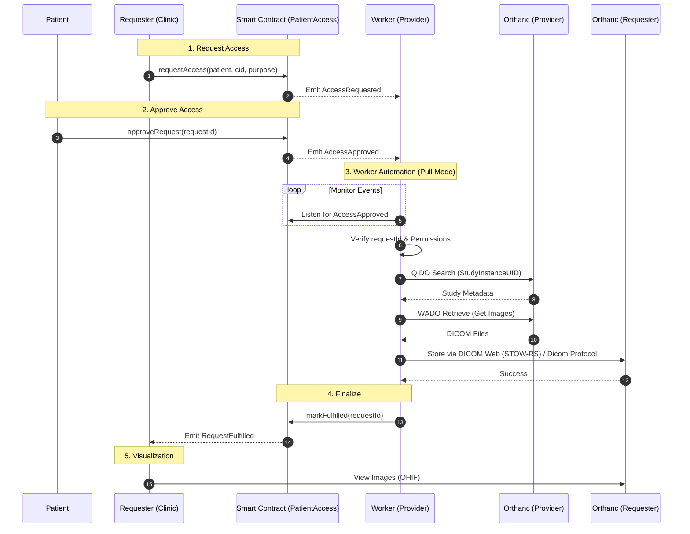

# Access Control Flow

This document outlines the interaction flow between the Patient, Blockchain, Worker, and Requester during the medical image access process.

## Description

1.  **Request**: Requester initiates a request on-chain.
2.  **Approval**: Patient signs a transaction to approve specific access.
3.  **Fulfillment**:
    *   Provider's Worker detects the approval event.
    *   Worker fetches DICOM data from Provider's Orthanc.
    *   Worker pushes data to Requester's Orthanc (or pulls if configured differently).
    *   Worker records the transfer in an internal audit log and potentially on-chain via `markFulfilled`.
4.  **Completion**: The cycle ends when the smart contract is updated with the fulfillment status.
