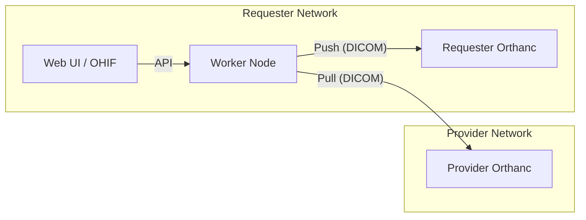
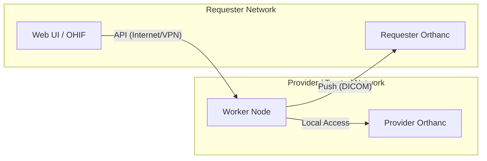

# デプロイメントパターン (Deployment Patterns)

このプロジェクトの **Worker** は、要件に応じて配置場所を柔軟に変更できます。
特に「誰がデータを検証・署名するか」という信頼モデルに基づいて、以下の2つのパターンから選択できます。

## パターンA: Requester-Side Worker (デフォルト)

開発時や小規模な検証で最も簡単な構成です。データを要求する側 (Requester) が Worker を運用します。

- **配置**: Requester の院内サーバー、またはクラウド。
- **信頼モデル**: Requester が自分でデータを取得し、自分で検証します。
- **メリット**: Requester 側のファイアウォール設定が簡単（Outbound 通信が主）。
- **デメリット**: Provider 側から見ると、Requester が勝手にデータを取得しているように見えるため、Provider 側の Firewall で Inbound 許可が必要です。

### 構成図


---

## パターンB: Provider-Side / Trusted Worker (推奨)

**「改竄のないデータ転送」** を保証するために、データを提供する側 (Provider) または信頼できる第三者機関 (TTP) が Worker を運用する構成です。ユーザー様のご要望はこちらのパターンになります。

- **配置**: Provider の院内サーバー、または TTP のデータセンター。
- **信頼モデル**: データ発生元 (Provider) が Worker を管理するため、Requester に届くデータが「Provider から正規に出力されたもの」であることが保証されます。
- **メリット**: Provider のデータガバナンスが効きやすい。
- **デメリット**: Requester 側で Inbound 通信 (Worker -> Requester Orthanc) の許可が必要です。

### 構成図


### 設定変更ガイド (worker/config.json)

Provider 側で Worker を動かす場合、`worker/config.json` を以下のように設定します。

#### 1. Provider Orthanc (ローカル接続)
Worker と同じネットワークにあるため、`localhost` や LAN IP で指定します。

```json
"providers": {
  "PROV-001": {
    "qido": {
      "baseUrl": "http://localhost:8042",  // または http://192.168.x.x:8042
      "auth": { ... }
    },
    // ... wado, rest も同様
  }
}
```

#### 2. Requester Orthanc (リモート接続)
インターネットまたは VPN 経由で Requester に送るため、Requester のグローバル IP または VPN アドレスを指定します。

```json
"requester": {
  "orthanc": {
    "baseUrl": "https://requester-clinic.example.com/orthanc", // または VPN IP
    "auth": { ... }
  }
}
```

#### 3. API サーバー (外部公開)
Requester のブラウザ (Web UI) からアクセスを受け付けるため、外部からの接続を許可します。

```json
"api": {
  "host": "0.0.0.0",  // すべてのインターフェースでリッスン
  "port": 8787,
  "corsOrigin": "https://requester-webapp.example.com" // Web UI のオリジンを許可
}
```

### ネットワーク要件

この構成を実現するためには、以下の通信許可が必要です。

1.  **Worker -> Requester Orthanc**:
    *   プロトコル: HTTP/HTTPS (DICOMweb STOW-RS)
    *   方向: Outbound (Provider) -> Inbound (Requester)
2.  **Web UI (Browser) -> Worker API**:
    *   プロトコル: HTTP/HTTPS (REST API)
    *   方向: Outbound (Requester User) -> Inbound (Provider)
